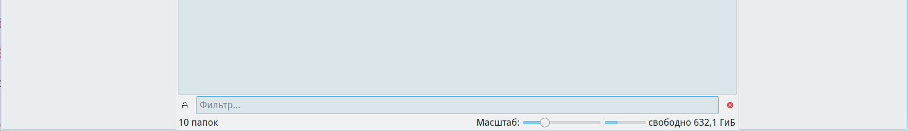
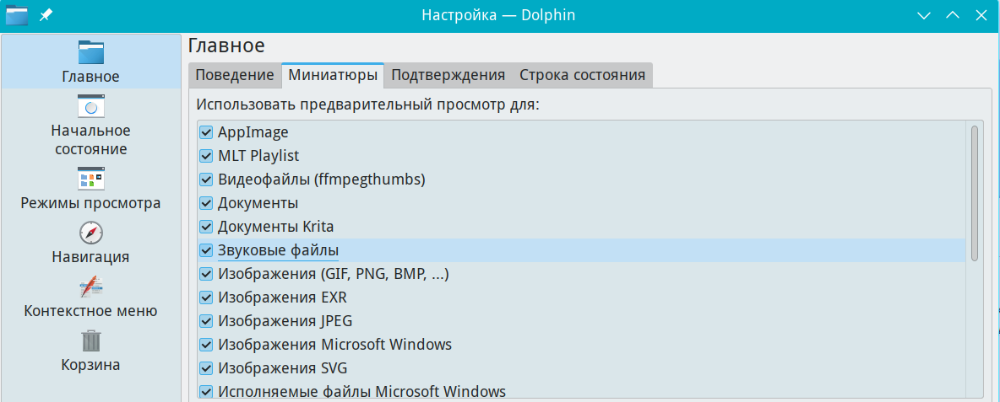

# Настройка dolphin

Документация по настройкам dolphin

Путь к конфигу: `~/.config/dolphinrc`

## Включение в dolphin по умолчанию панели фильтров

### Меню Dolphin - Настройка - Настроить Dolphin... - Начальное состояние - Панель фильтра



```ini
[General]
FilterBar=true
```

Допустимые значения параметра:

* `FilterBar=true` — включать панель фильтра
* `FilterBar=false` — выключать панель фильтра

## Настройка отображения миниатюр в dolphin

## Миниатюты

### Меню Dolphin - Настройка - Настроить Dolphin... - Главное - Миниатюры



При включении отображения всех миниатюр, в файл конфига добавляется параметр

```ini
[PreviewSettings]
Plugins=appimagethumbnail,mltpreview,ffmpegthumbs,opendocumentthumbnail,
kraorathumbnail,audiothumbnail,imagethumbnail,exrthumbnail,jpegthumbnail,
windowsimagethumbnail,svgthumbnail,windowsexethumbnail,comicbookthumbnail,
directorythumbnail,textthumbnail,blenderthumbnail,djvuthumbnail,gsthumbnail,
cursorthumbnail,fontthumbnail,rawthumbnail,ebookthumbnail,mobithumbnail
```

Для отключения отображения любых миниатюр, нужно из секции удалить все движки миниатюр,

приведя запись секции к такому виду.

```ini
[PreviewSettings]
Plugins=
```

#### Движки отображения миниатюр

* `appimagethumbnail` — AppImage

* `mltpreview` — MLT Playlist

* `ffmpegthumbs` — Видеофайлы

* `opendocumentthumbnail` — Документы

* `kraorathumbnail` — Документы Krita

* `audiothumbnail` — Звуковые файлы

* `imagethumbnail` — Изображения (GIF, PNG, BMP, ...)

* `exrthumbnail` — Изображения EXR

* `jpegthumbnail` — Изображения JPEG

* `windowsimagethumbnail` — Изображения Microsoft Windows

* `svgthumbnail` — Изображения SVG

* `windowsexethumbnail` — Исполняемые файлы Microsoft Windows

* `comicbookthumbnail` — Комиксы

* `directorythumbnail` — Папки

* `textthumbnail` — Текстовые файлы

* `blenderthumbnail` — Файлы Blender

* `djvuthumbnail` — Файлы DjVu

* `gsthumbnail` — Файлы PostScript, PDF и DVI

* `cursorthumbnail` — Файлы курсоров

* `fontthumbnail` — Файлы шрифтов

* `rawthumbnail` — Цифровые негативы (RAW)

* `ebookthumbnail` — Электронные книги

* `mobithumbnail` — Электронные книги Mobipocket

### Блокировка параметров

Для запрета пользователю производить изменение отображения миниатюр,

с полным запретом отображения миниатюр, в файле `/etc/xdg/dolphinrc`

блокируется изменение параметров, символами блокировки строки параметра `[$i]`,

и отображения миниатюр становятся недоступны для изменения:

##### Блокировка строки параметра

```ini
[PreviewSettings]
Plugins[$i]=
```

##### Блокировка секции

```ini
[PreviewSettings][$i]
Plugins=
```
