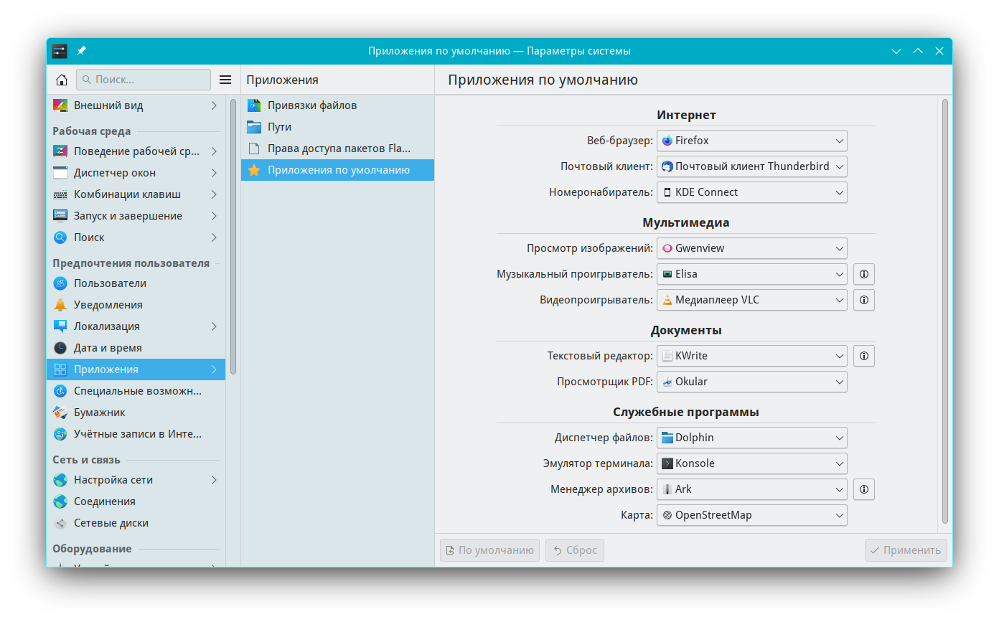

# Настройки приложений по умолчанию

Документация по управлению приложениями

Путь к конфигу: `~/.config/filetypesrc`
Путь к конфигу: `~/.config/mimeapps.list`

## Приложения по умолчанию

### Приложения - Приложения по умолчанию



### Текстовый редактор

При выборе текстового редактора по умолчанию, текстовый редактор kate,

в конфиги добавляются новые параметры.

В файл `~/.config/mimeapps.list` добавляются строки параметров

```ini
[Added Associations]
application/json=kde5-org.kde.kate.desktop;
application/x-docbook+xml=kde5-org.kde.kate.desktop;
application/x-yaml=kde5-org.kde.kate.desktop;
text/markdown=kde5-org.kde.kate.desktop;
text/plain=kde5-org.kde.kate.desktop;
text/x-cmake=kde5-org.kde.kate.desktop;
```

```ini
[Default Applications]
application/json=kde5-org.kde.kate.desktop;
application/x-docbook+xml=kde5-org.kde.kate.desktop;
application/x-yaml=kde5-org.kde.kate.desktop;
text/markdown=kde5-org.kde.kate.desktop;
text/plain=kde5-org.kde.kate.desktop;
text/x-cmake=kde5-org.kde.kate.desktop;
```

В созданный файл `~/.config/filetypesrc` добавляются строки параметров

```ini
[EmbedSettings]
embed-application/json=false
embed-application/x-docbook+xml=false
embed-application/x-yaml=false
embed-text/markdown=false
embed-text/plain=false
embed-text/x-cmake=false
```

При выборе текстового редактора по умолчанию, текстовый редактор kwrite,

в конфиги добавляются новые параметры.

```ini
[Added Associations]
application/json=kde5-org.kde.kwrite.desktop;kde5-org.kde.kate.desktop;
application/x-docbook+xml=kde5-org.kde.kwrite.desktop;kde5-org.kde.kate.desktop;
application/x-yaml=kde5-org.kde.kwrite.desktop;kde5-org.kde.kate.desktop;
text/markdown=kde5-org.kde.kwrite.desktop;kde5-org.kde.kate.desktop;
text/plain=kde5-org.kde.kwrite.desktop;kde5-org.kde.kate.desktop;
text/x-cmake=kde5-org.kde.kwrite.desktop;kde5-org.kde.kate.desktop;
```

```ini
[Default Applications]
application/json=kde5-org.kde.kwrite.desktop;
application/x-docbook+xml=kde5-org.kde.kwrite.desktop;
application/x-yaml=kde5-org.kde.kwrite.desktop;
text/markdown=kde5-org.kde.kwrite.desktop;
text/plain=kde5-org.kde.kwrite.desktop;
text/x-cmake=kde5-org.kde.kwrite.desktop;
```

