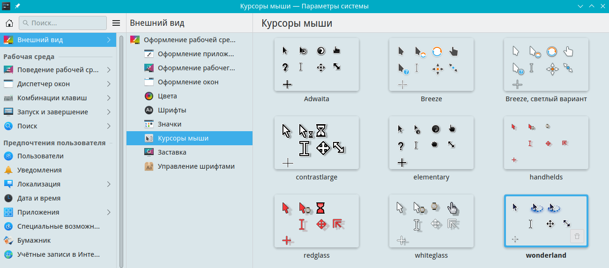

# Настройка курсоров мыши

Документация по настройкам курсоров мыши

Путь к конфигу: `~/.config/kcminputrc`

## Курсоры мыши

### Внешний вид - Курсоры мыши



Используются темы курсоров, доступные в `/usr/share/icons`

Допустимые значения параметра:

#### Breeze

```ini
[Mouse]
cursorTheme=breeze_cursors
```

#### Breeze, светлый вариант

```ini
[Mouse]
cursorTheme=Breeze_Snow
```

#### Wonderland

```ini
[Mouse]
cursorTheme=wonderland
```

Для запрета пользователю производить изменение курсоров мыши, в файле `/etc/xdg/kcminputrc`

блокируется изменение параметров, символами блокировки строки параметра `[$i]`, и курсороы мыши становятся

недоступны для изменения:

### Блокировка самой темы

#### Breeze

```ini
[Mouse]
cursorTheme[$i]=breeze_cursors
```

#### Breeze, светлый вариант

```ini
[Mouse]
cursorTheme[$i]=Breeze_Snow
```

### Блокировка группы

#### Wonderland

```ini
[Mouse][$i]
cursorTheme=wonderland
```


## Другая настройка

Здесь описать какую-либо другую настройку...
