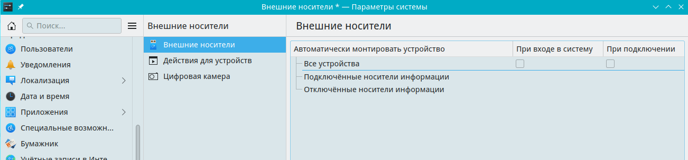

# Настройки подключаемых устройскв

Путь к конфигу: `~/.config/kded_device_automounterrc`

## Внешние носители

### Внешние носители - Внешние носители



При включении чекбокса

### Автоматичеки монтировать устройства:

#### При входе в систему

в конфиг добавляется:

```ini
[General]
AutomountEnabled=true
AutomountOnLogin=true
```
### Автоматичеки монтировать устройства:

#### При подключении

в конфиг добавляется:

```ini
[General]
AutomountEnabled=true
AutomountOnPlugin=true
```

#### Автоматически монтировать те носители, которые никогда ранее

#### не были примонтированы вручную

```ini
[General]
AutomountEnabled=false
AutomountOnLogin=false
AutomountUnknownDevices=false
```

Допустимые значения параметра:

### Автоматичеки монтировать устройства

* `AutomountEnabled=false` — автоматическое монтирование отключено
* `AutomountEnabled=true` — автоматическое монтирование включено

#### При входе в систему

* `AutomountOnLogin=false` — автоматическое монтирование отключено
* `AutomountOnLogin=true` — автоматическое монтирование включено

#### При подключении

* `AutomountOnPlugin=false` — автоматическое монтирование отключено
* `AutomountOnPlugin=true` — автоматическое монтирование включено

#### Которые никогда ранее не были примонтированы вручную

* `AutomountUnknownDevices=false` — автоматическое монтирование отключено
* `AutomountUnknownDevices=true` — автоматическое монтирование включено

## Блокировка параметров

### Блокировка изменения параметров автоматического подключения внешних носителей

Для запрета пользователю производить изменение параметров автоматического монтирования, в файле `/etc/kded_device_automounterrc`

блокируется изменение параметров, символами блокировки строки параметра `[$i]`, и чекбоксы становятся

неактивными для изменения:

#### Запрет включения параметров автоматического подключения внешних носителей

#### сразу для всех параметров, заблокировав всю группу

```ini
[General][$i]
AutomountEnabled=false
AutomountOnLogin=false
AutomountUnknownDevices=false
```

#### Запрет включения параметров автоматического подключения внешних носителей

#### для каждого параметра по отдельности

```ini
[General]
AutomountEnabled[$i]=false
AutomountOnLogin[$i]=false
AutomountUnknownDevices[$i]=false
```
