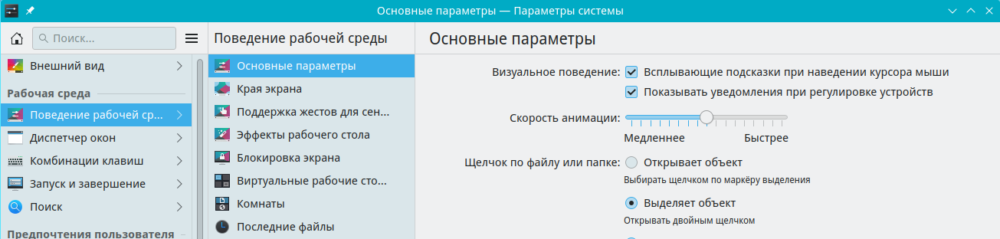
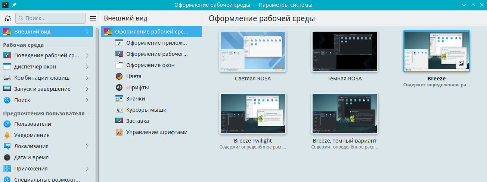
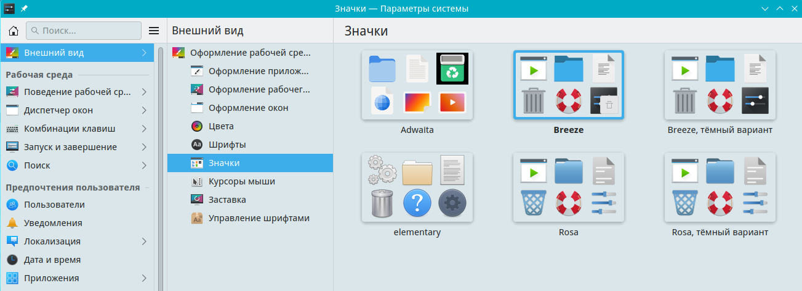

# Общие настройки

Документация по kdeglobals

Путь к конфигу: `~/.config/kdeglobals`

## Основные параметры

### Поведение рабочей среды - Основные параметры



Щелчок по файлу или папке:

```ini
[KDE]
SingleClick=false
```

Параметр `SingleClick` используется для открытия папки или файла одним щелчком.

Допустимые значения параметра:

* `SingleClick=false` — выделяет объект
* `SingleClick=true` — открывает объект

### Блокировка параметров

Для запрета пользователю производить изменение поведения щелчка по файлу или папке, в файле `/etc/xdg/kdeglobals`

блокируется изменение параметров, символами блокировки строки параметра `[$i]`, и изменение становятся

недоступно для изменения:

```ini
[KDE]
SingleClick[$i]=false
```

## Удалить

### Контекстное меню dolphin - Удалить

Полное удаление папок и файлов:

```ini
[KDE]
ShowDeleteCommand=true
```

Допустимые значения параметра:

* `ShowDeleteCommand=false` — убрать кнопку `Удалить` из контекстного меню
* `ShowDeleteCommand=true` — добавить кнопку `Удалить` в контекстное меню

### Блокировка параметров

Для запрета пользователю производить изменение парамеров полного удаления папок и файлов, в файле `/etc/xdg/kdeglobals`

блокируется изменение параметров, символами блокировки строки параметра `[$i]`, и изменение становятся

недоступно для изменения:

```ini
[KDE]
ShowDeleteCommand[$i]=false
```

## Оформление рабочей среды

### Внешний вид - Оформление рабочей среды



Используются оформления рабочей среды, доступные в каталоге `/usr/share/plasma/look-and-feel`

Допустимые значения параметра:

#### Светлая Rosa

```ini
[KDE]
LookAndFeelPackage=org.kde.rosalight.desktop
```

#### Breeze

```ini
[KDE]
LookAndFeelPackage=org.kde.breeze.desktop
```

#### Breeze, тёмный вариант

```ini
[KDE]
LookAndFeelPackage=org.kde.breezedark.desktop
```

### Блокировка параметров

Для запрета пользователю производить изменение оформления рабочей среды, в файле `/etc/xdg/kdeglobals`

блокируется изменение параметров, символами блокировки строки параметра `[$i]`, и оформления рабочей среды становятся

недоступны для изменения:

#### Светлая Rosa

```ini
[KDE]
LookAndFeelPackage[$i]=org.kde.rosalight.desktop
```

#### Breeze

```ini
[KDE]
LookAndFeelPackage[$i]=org.kde.breeze.desktop
```

Если в файле `/etc/xdg/kdeglobals` совсем не задана тема оформления,

то будет использоваться оформление `org.kde.breeze.desktop`

Если в файле `/etc/xdg/kdeglobals` задана несуществующая тема оформления,

или название указано с ошибкой, то будет использоваться оформление `org.kde.breeze.desktop`

## Цвета

### Внешний вид - Цвета


Используются цветовые схемы, доступные в `/usr/share/color-schemes`

Допустимые значения параметра:

#### Breeze, светлый вариант

```ini
[General]
ColorScheme=BreezeLight
```

#### Breeze, цвет морской волны

```ini
[General]
ColorScheme=BreezeAqua
```

#### Breeze, классический вариант

```ini
[General]
ColorScheme=BreezeClassic
```

#### Светлая Rosa

```ini
[General]
ColorScheme=ROSALight
```

### Блокировка параметров

Для запрета пользователю производить изменение цветовых схем, в файле `/etc/xdg/kdeglobals`

блокируется изменение параметров, символами блокировки строки параметра `[$i]`, и цветовые схемы становятся

недоступны для изменения:


#### Светлая Rosa

```ini
[General]
ColorScheme[$i]=ROSALight
```

Если в файле `/etc/xdg/kdeglobals` совсем не задана цветовая схема,

а если задана, но не заблокирована символами блокировки строки параметра `[$i]`,

то будет использоваться цветовая схема, из темы оформления рабочей среды, заданной в файле

`/etc/xdg/kdeglobals`, из настроек по умолчанию для этой темы, заданных в файле

/usr/share/plasma/look-and-feel/`«оформление рабочей среды»`/contents/defaults


## Значки

### Внешний вид - Значки



Используются темы значков, доступные в `/usr/share/icons`

Допустимые значения параметра:

#### Breeze

```ini
[Icons]
Theme=breeze
```

#### Breeze, тёмный вариант

```ini
[Icons]
Theme=breeze-dark
```

#### Rosa

```ini
[Icons]
Theme=rosa5
```

#### Rosa, тёмный вариант

```ini
[Icons]
Theme=rosa5-dark
```

### Блокировка параметров

Для запрета пользователю производить изменение темы значков, в файле `/etc/xdg/kdeglobals`

блокируется изменение параметров, символами блокировки строки параметра `[$i]`, и темы значков становятся

недоступны для изменения:

```ini
[Icons]
Theme[$i]=rosa5
```

Если в файле `/etc/xdg/kdeglobals` совсем не задана тема значков,

а если задана, но не заблокирована символами блокировки строки параметра `[$i]`,

то будет использоваться тема значков, из темы оформления рабочей среды, заданной в файле

`/etc/xdg/kdeglobals`, из настроек по умолчанию для этой темы, заданных в файле

/usr/share/plasma/look-and-feel/`«оформление рабочей среды»`/contents/defaults

