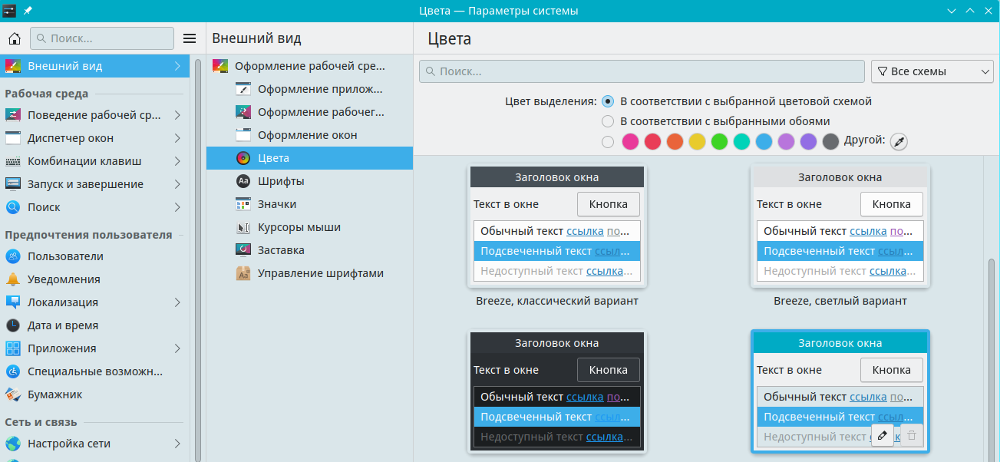

# Общие настройки

Документация по kdeglobals

Путь к конфигу: `~/.config/kdeglobals`

## Основные параметры

### Поведение рабочей среды - Основные параметры


Щелчок по файлу или папке:

```ini
[KDE]
SingleClick=false
```

Параметр `SingleClick` используется для открытия папки или файла одним щелчком.

Допустимые значения параметра:

* `Enabled=false` — выделяет объект
* `Enabled=true` — открывает объект

## Удалить

### Контекстное меню dolphin - Удалить

Полное удаление папок и файлов:

```ini
[KDE]
ShowDeleteCommand=true
```

Допустимые значения параметра:

* `Enabled=false` — убрать кнопку `Удалить` из контекстного меню
* `Enabled=true` — добавить кнопку `Удалить` в контекстное меню

## Оформление рабочей среды

### Внешний вид - Оформление рабочей среды


Используются оформления рабочей среды, доступные в `/usr/share/plasma/look-and-feel`

Допустимые значения параметра:

#### Светлая Rosa

```ini
[KDE]
LookAndFeelPackage=org.kde.rosalight.desktop
```

#### Breeze

```ini
[KDE]
LookAndFeelPackage=org.kde.breeze.desktop
```

#### Breeze, тёмный вариант

```ini
[KDE]
LookAndFeelPackage=org.kde.breezedark.desktop
```

## Цвета

### Внешний вид - Цвета



Используются цветовые схемы, доступные в `/usr/share/color-schemes`

Допустимые значения параметра:

#### Breeze, светлый вариант

```ini
[General]
ColorScheme=BreezeLight
```

#### Breeze, цвет морской волны

```ini
[General]
ColorScheme=BreezeAqua
```

#### Breeze, классический вариант

```ini
[General]
ColorScheme=BreezeClassic
```

#### Светлая Rosa

```ini
[General]
ColorScheme=ROSALight
```

## Значки

### Внешний вид - Значки


Используются темы значков, доступные в `/usr/share/icons`

Допустимые значения параметра:

#### Breeze

```ini
[Icons]
Theme=breeze
```

#### Breeze, тёмный вариант

```ini
[Icons]
Theme=breeze-dark
```

#### Rosa

```ini
[Icons]
Theme=rosa5
```

#### Rosa, тёмный вариант

```ini
[Icons]
Theme=rosa5-dark
```

## Другая настройка

Здесь описать какую-либо другую настройку...
