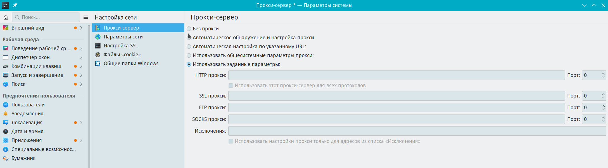

# Прокси-сервер

Путь к конфигу: `~/.config/kioslaverc`

### Настройка сети - Прокси-сервер



### При переключении параметров прокси-сервера

в конфиг добавляется:

```ini
[Proxy Settings]
NoProxyFor=
Proxy Config Script=
ProxyType=0
ReversedException=false
ftpProxy=
httpProxy=
httpsProxy=
socksProxy=
```

Допустимые значения параметра:

* `ProxyType=0` — без прокси
* `ProxyType=1` — использовать заданные параметры
* `ProxyType=2` — автоматическая настройка по указанному URL
* `ProxyType=3` — автоматическое обнаружение и настройка прокси
* `ProxyType=4` — использовать общесистемные настройки прокси

##### Дополнительные параметры прокси-сервера

При включении `Автоматическая настройка по указанному URL`

указывается адрес параметром

* `Proxy Config Script=` — адрес, например, `Proxy Config Script=10.132.8.120`

При включении `Использовать общесистемные настройки прокси`

указывается адрес параметром, например, 10.142.126.28

* `ftpProxy=10.142.126.28` - ftp

* `httpProxy=10.142.126.28` - http

* `httpsProxy=10.142.126.28` - https

* `socksProxy=10.142.126.28` - socks

* `NoProxyFor=` - не использовать прокси для указанного адреса,

например, `NoProxyFor=10.142.126.21`

При включении `Использовать заданные параметры`

указывается адрес и потр параметром, например, 10.142.126.28 8080

* `ftpProxy=ftp://10.142.126.28 8080` - ftp

* `httpProxy=http://10.142.126.28 8080` - http

* `httpsProxy=http://10.142.126.28 8080` - https

* `socksProxy=socks://10.142.126.28 8080` - socks

* `NoProxyFor=` - исключения, например, `NoProxyFor=127.0.0.1`

Использовать настройки прокси только для адресов из списка «Исключения»

* `ReversedException=true` - включено

* `ReversedException=false` - отключено


## Блокировка параметров

### Блокировка параметров прокси-сервера

Для запрета пользователю производить изменение параметров прокси-сервера, в файле `/etc/xdg/kioslaverc` блокируется изменение параметров, символами блокировки строки параметра `[$i]`, и чекбоксы становятся неактивными для изменения:

### Запрет изменения сразу всех параметров блокировкой секции

```ini
[Proxy Settings][$i]
```

### Запрет изменения блокировкой определённого параметра

Например блокировкой парамера `ProxyType=0` — без прокси

```ini
[Proxy Settings]
NoProxyFor=
Proxy Config Script=
ProxyType[$i]=0
ReversedException=false
ftpProxy=
httpProxy=
httpsProxy=
socksProxy=
```
