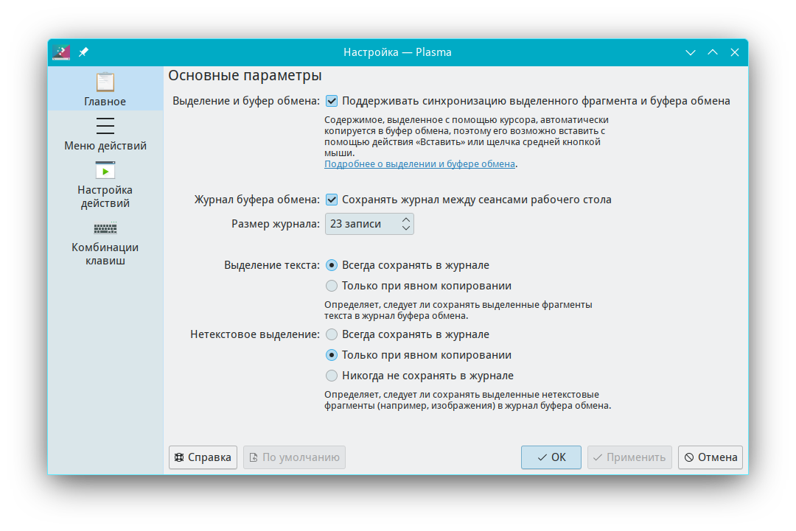

# Настройки управлением буфера обмена

Документация по управлению буфером обмена

Путь к конфигу: `~/.config/klipperrc`

## Буфер обмена

### Контекстное меню на значке виджета буфера обмена

### в системном лотке - Настроить буфер обмена...



После настройки в конфиг добавляется:

```ini
[General]
AutoStart=false
IgnoreImages=false
IgnoreSelection=false
MaxClipItems=2
SyncClipboards=true
```

Допустимые значения параметра:

#### Автозапуск

Параметр `AutoStart` относится только к приложению klipper.

На виджет в системном лотке он не влияет.

Значения параметра

* `Enabled=false` — не запускать klipper при запуска сеанса
* `Enabled=true` — запускать klipper при запуска сеанса

#### Выделение и буфер обмена

Параметры `SyncClipboards=true` и `IgnoreSelection=false` включают

сихронизацию выделения с буфером обмена.

Для отключения синхронизации выделения с буфером обмена, строки этих

двух параметров должны быть полностью удалены

```ini
[General]
AutoStart=false
IgnoreImages=false
MaxClipItems=2
```

#### Выделение текста

Параметр `IgnoreSelection` включает сохранение выделенного текста в журнал.

Значения параметра

* `Enabled=false` — всегда сохранаять в журнал
* `Enabled=true` — только при явном копировании

Значение параметра `Enabled=true` работает, только если синхронизации выделения с буфером

обмена включена строкой параметра `SyncClipboards=true`


#### Журнал буфера обмена

Параметр `KeepClipboardContents` включает сохранение журнала между сеансами рабочего стола.

Значения параметра

* `Enabled=false` — не сохранять журнал между сеансами рабочего стола
* `Enabled=true` — сохранять журнал между сеансами рабочего стола

#### Размер журнала

Параметр `MaxClipItems` указывает количество записей буфера обмена, сохранаемых в журнале.

Значения параметра, например:

* `MaxClipItems=4` — сохранять в журнале четыре записи


#### Нетекстовое выделение

Параметр `SelectionTextOnly` включает сохранение нетекстового выделения в журнал.
Параметр `IgnoreImages` включает сохранение нетекстового выделения, файлов изображений, в журнал.

Значения параметра, например:

##### Всегда сохранать в журнале

* `SelectionTextOnly=false` — всегда сохранать в журнале
* `IgnoreImages=false` — всегда сохранать в журнале

Значение параметра `Всегда сохранать в журнале` работает, только если синхронизации выделения

с буфером обмена включена строкой параметра `SyncClipboards=true`

##### Никогда не сохранать в журнале

* `SelectionTextOnly=false` — никогда не сохранать в журнале
* `IgnoreImages=true` — никогда не сохранать в журнале

##### Только при явном выделение

* `IgnoreImages=false` — только при явном выделение

Строка параметра `SelectionTextOnly=false` должна быть полностью удалена из файла `~/.config/klipperrc`


#### Показ всплывающего меню действий

### Сразу после выделения

При включении этой галочки в чекбоксе, добавляется параметр:

* `URLGrabberEnabled=true`

для отключения показа всплывающего меню действий сразу после выделения,

указанная строка парамера полностью удаляется.

Для запрета включения этого парамера, требуется

блокировка всей группы параметров, описанная ниже.

### Для выбранной в журнале записи

При включении этой галочки в чекбоксе, добавляется параметр:

```ini
[Actions]
ReplayActionInHistory=true
```

для отключения показа всплывающего меню действий,

указанные строки парамеров полностью удаляется.

#### Время показа меню автоматических действий

Если в файле `/etc/xdg/klipperrc` не задано время, то время отображения 8 (восемь) секунд.

Для изменения времени показа меню автоматических действий,

добавляется параметр, например, `TimeoutForActionPopups=7` для 7 (семи) секунд.

```ini
[General]
AutoStart=false
IgnoreImages=false
MaxClipItems=2
TimeoutForActionPopups=7
```

Значения параметра:

* `TimeoutForActionPopups=9` - плюс время в секундах, отличное от 8, например 9.

#### Парамеры: Обрезать пробелы выделения

При отключении этой галочки в чекбоксе, добавляется параметр:

```ini
[Actions]
StripWhiteSpace=false
```

для включения параметра «Обрезать пробелы выделения»

указанные строки парамеров полностью удаляется.

#### Парамеры: Включить действия на основе типов MIME

При отключении этой галочки в чекбоксе, добавляется параметр:

```ini
[Actions]
EnableMagicMimeActions=false
```

для включения параметра «Включить действия на основе типов MIME»

указанные строки парамеров полностью удаляется.

## Блокировка параметров

Для запрета пользователю производить изменение параметров буфера обмена, в файле `/etc/xdg/klipperrc`

блокируется изменение параметров, символами блокировки строки параметра `[$i]`, и изменение

параметров буфера обмена становится недоступно для изменения, например:

#### Отдельные парамеры

Запрет автозапуска приложения klipper

Макимальное количество записей в буфере обмена две строки

```ini
[General]
AutoStart[$i]=false
IgnoreImages=false
MaxClipItems[$i]=2
```

#### Все парамеры

Блокировка всей группы параметров

```ini
[General][$i]
AutoStart=false
IgnoreImages=false
MaxClipItems=2
```
