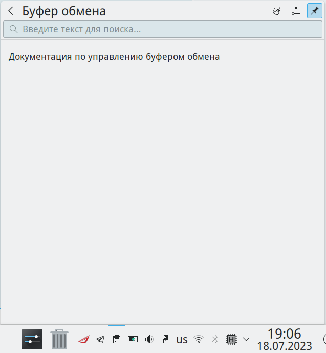

# Настройки управлением буфера обмена

Документация по управлению буфером обмена

Путь к конфигу: `~/.config/klipperrc`

## Буфер обмена

### Контекстное меню на значке виджета буфера обмена

### в системном лотке - Настроить буфер обмена...



Допустимые значения параметра:

```ini
[General]
AutoStart=false
IgnoreImages=false
MaxClipItems=2
Number of Actions=0
SyncClipboards=false
```

## Блокировка параметров

Для запрета пользователю производить изменение параметров буфера обмена, в файле `/etc/xdg/klipperrc`

блокируется изменение параметров, символами блокировки строки параметра `[$i]`, и изменение

параметров буфера обмена становится недоступно для изменения, например:

```ini
[General]
AutoStart=false
IgnoreImages=false
MaxClipItems=2
Number of Actions=0
SyncClipboards=false
```
