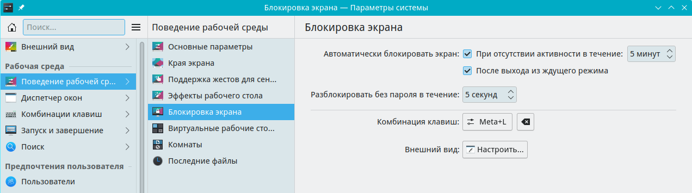
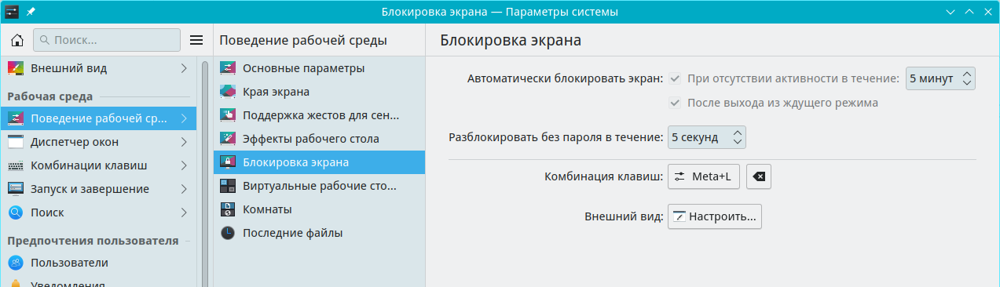

# Настройки kscreenlocker

Документация по блокировкам kscreenlocker

Путь к конфигу: `~/.config/kscreenlockerrc`

## Блокировка экрана

### Поведение рабочей среды - Блокировка экрана



После снятия галочек «Автоматически блокировать экран», соэдаётся файл ~/.config/kscreenlockerrc с текстом:

```ini
[Daemon]
Autolock=false
LockOnResume=false
```

Параметр `Autolock` используется для автоматической блокировки при простое сеанса.

Параметр `LockOnResume=false` используется для блокировки после выхода из ждущего режима.

Другие допустимые значения параметра:

* `Enabled=false` — не включать функцию блокировки при входе в систему
* `Enabled=true` — включать функцию блокировки при входе в систему

#### Задержка 60 минут до начала блокировки экрана

```ini
[Daemon]
Timeout=60
```

#### Блокировать экран при запуске сеанса.

```ini
[Daemon]
LockOnStart=true
```

Параметр `LockOnStart=true` используется, например, в plasma-mobile для запроса пин-кода при запуске сеанса.

### Блокировка отключения параметров автоматической блокировки.



Для запрета пользователю производить отключение блокировщика экрана, в файле `/etc/xdg/kscreenlockerrc`

блокируется отключение блокировки символами блокировки строки параметра `[$i]`, и чекбоксы становятся неактивными для изменения:

```ini
[Daemon]
Autolock[$i]=true
LockOnResume[$i]=true
```

## Другая настройка

Здесь описать какую-либо другую настройку...
