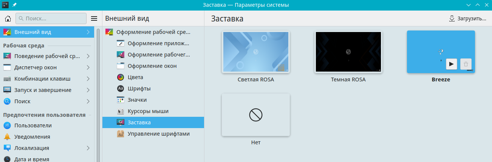

# Настройка заставки

Документация по настройкам заставки

Путь к конфигу: `~/.config/ksplashrc`

## Заставка

### Внешний вид - Заставка



Используются заставки, доступные в `/usr/share/plasma/look-and-feel/«Тема оформления рабочей среды»`

Допустимые значения параметра:

#### Breeze

```ini
[KSplash]
Theme=org.kde.breeze.desktop
```

#### Rosa, светлый вариант

```ini
[KSplash]
Theme=org.kde.rosalight.desktop
```

#### Rosa, тёмный вариант

```ini
[KSplash]
Theme=org.kde.rosadark.desktop
```

### Блокировка параметров

Для запрета пользователю производить изменение заставки, в файле `/etc/xdg/ksplashrc`

блокируется изменение параметров, символами блокировки строки параметра `[$i]`, и заставки становятся

недоступны для изменения:

```ini
[KSplash]
Theme=[$i]org.kde.rosalight.desktop
```
