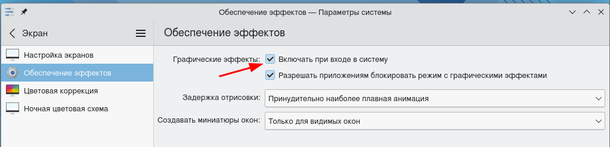
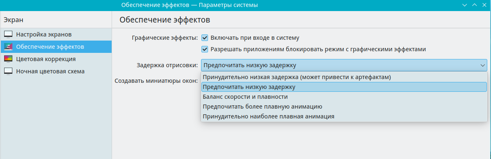

# Настройки kwin

kwin — оконный менеджер.

Путь к конфигу: `~/.config/kwinrc`

## Эффекты

Экран - Обеспечение эффектов - Включать при входе в систему



После снятия галки в конфиг добавляется:

```ini
[Compositing]
Enabled=false
```

Допустимые значения параметра:

* `Enabled=false` — не включать эффекты при входе в систему
* `Enabled=true` — включать эффекты при входе в систему

Экран - Обеспечение эффектов - Задержка отрисовки



Допустимые значения параметра:

#### Принудительно низкая задержка (может привести к артефактам)

```ini
[Compositing]
LatencyPolicy=ExtremelyLow
```

#### Предпочитать низкую задержку

```ini
[Compositing]
LatencyPolicy=Low
```

#### Баланс скорости и плавности

```ini
[Compositing]
LatencyPolicy=Medium
```

#### Предпочитать более плавную анимацию

```ini
[Compositing]
LatencyPolicy=High
```
#### Принудительно наиболее плавная анимация

Значение, «Принудительно наиболее плавная анимация», является значением по умолчании.

Оно не имеет записи в файле `~/.config/kwinrc`

Если для парамера

### [Compositing]


не указано не одного из значений «LatencyPolicy», то используется значение «Принудительно наиболее плавная анимация».


Конкретные эффекты настраиваются отдельно, пока что представляется нецелесообразным делать возможность их централизированной настройки, достаточно простой настройки, включать ли их (например, набор по умолчанию) или нет.

## Другая настройка

Здесь описать какую-либо другую настройку...
