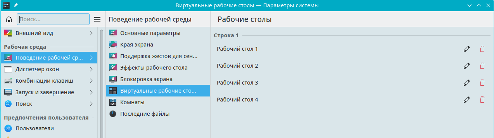

# Настройки kwin

kwin — оконный менеджер.

Путь к конфигу: `~/.config/kwinrc`

## Эффекты

### Экран - Обеспечение эффектов - Включать при входе в систему


После снятия галки в конфиг добавляется:

```ini
[Compositing]
Enabled=false
```

Допустимые значения параметра:

* `Enabled=false` — не включать эффекты при входе в систему
* `Enabled=true` — включать эффекты при входе в систему

## Блокировка параметров

Для запрета пользователю производить изменение включения эффектов, в файле `/etc/xdg/kwinrc`

блокируется изменение параметров, символами блокировки строки параметра `[$i]`, и включение эффектов становится

недоступно для изменения:


```ini
[Compositing]
Enabled[$i]=false
```

### Экран - Обеспечение эффектов - Задержка отрисовки


Допустимые значения параметра:

#### Принудительно низкая задержка (может привести к артефактам)

```ini
[Compositing]
LatencyPolicy=ExtremelyLow
```

#### Предпочитать низкую задержку

```ini
[Compositing]
LatencyPolicy=Low
```

#### Баланс скорости и плавности

```ini
[Compositing]
LatencyPolicy=Medium
```

#### Предпочитать более плавную анимацию

```ini
[Compositing]
LatencyPolicy=High
```

#### Принудительно наиболее плавная анимация

Значение, «Принудительно наиболее плавная анимация», является значением по умолчании.

Оно не имеет записи в файле `~/.config/kwinrc`

Если для парамера `[Compositing]` не указано не одного из значений «LatencyPolicy», то используется значение «Принудительно наиболее плавная анимация».


Конкретные эффекты настраиваются отдельно, пока что представляется нецелесообразным делать возможность их централизированной настройки, достаточно простой настройки, включать ли их (например, набор по умолчанию) или нет.

## Блокировка параметров

Для запрета пользователю производить изменение задержки отрисовки, в файле `/etc/xdg/kwinrc`

блокируется изменение параметров, символами блокировки строки параметра `[$i]`, и задержки отрисовки становятся

недоступны для изменения:

#### Предпочитать низкую задержку

```ini
[Compositing]
LatencyPolicy[$i]=Low
```

#### Баланс скорости и плавности

```ini
[Compositing]
LatencyPolicy[$i]=Medium
```

#### Предпочитать более плавную анимацию

```ini
[Compositing]
LatencyPolicy[$i]=High
```

## Виртуальные рабочие столы

### Поведение рабочей среды - Виртуальные рабочие столы





Запись в конфиге: `~/.config/kwinrc`:

```ini
[Desktops]
Rows=1
Number=4
```


Допустимые значения параметра:

* `Rows=1` — количество строк отображения виртуальных окон на панели
* `Number=4` — количество виртуальных окон на панели

### Сенсорный режим работы

При включении сенсорного режима, добавляется параметр

```ini
[Input]
TabletMode=on
```

Допустимые значения параметра:

* `TabletMode=on` — использовать всегда

* `TabletMode=off` — никогда не использовать

## Блокировка параметров

Для запрета пользователю производить изменение количества виртуальных рабочих столов, в файле `/etc/xdg/kwinrc`

блокируется изменение параметров, символами блокировки строки параметра `[$i]`, и виртуальные рабочие столы становятся

недоступны для изменения:

## Блокировка сразу всех параметров

```ini
[Desktops][$i]
Rows=1
Number=4
```


## Блокировка каждого параметра по отдельности

```ini
[Desktops]
Rows[$i]=1
Number[$i]=4
```
