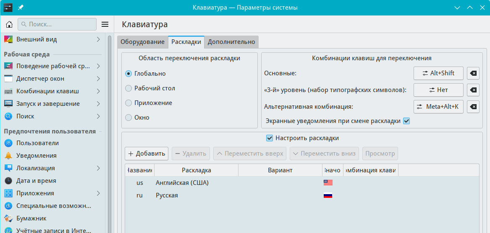

# Настройки раскладок клавиатуры

Документация по управлению раскладкой клавиатуры

Путь к конфигу: `~/.config/kxkbrc`

## Приложения по умолчанию

### Устройства ввода - Клавиатуа - Раскладки



### Раскладки

При добавлений в систему раскладок, например,

Английской(США) и Русской, в файл `~/.config/kxkbrc`

в секцию `[Layout]` добавляются выбранные раскладки

в параметр `LayoutList=`.

Допустимые значения параметра, например:

* `us` — Английская (США)
* `ru` — Русская
* `de` — Немецкая

##### Раскладки не настроены

```ini
[Layout]
DisplayNames=
LayoutList=
Model=pc104
Options=
```

##### Добавлена русская раскладка

```ini
[Layout]
DisplayNames=
LayoutList=ru
Model=pc104
Options=
```

##### Добавлена русская и английская раскладки

```ini
[Layout]
DisplayNames=,
LayoutList=us,ru
Model=pc104
Options=
VariantList=,
```

При количестве раскладок, больше одной, добавляется новый

параметр `VariantList=,` со знаком запятой `,`

для каждой последующей раскладки.

* `VariantList=,` — две раскладки
* `VariantList=,,` — три раскладки
* `VariantList=,,,` — четыре раскладки

Так же ведёт себя и параметр `DisplayNames=`

При количестве раскладок, больше одной, добавляется знак запятой `,`

для каждой последующей раскладки.

* `DisplayNames=,` — две раскладки
* `DisplayNames=,,` — три раскладки
* `DisplayNames=,,,` — четыре раскладки

### Комбинации клавиш переключения раскладки

При добавлений комбинации клавиш, в файл `~/.config/kxkbrc`

в секцию `Options=` добавляются комбинации клавиш

параметром `grp:`.

Допустимые значения параметра, например:

* `grp:alt_shift_toggle` — Alt+Shift
* `grp:ctrl_alt_toggle` — Alt+Ctrl
* `grp:alt_caps_toggle` — Alt+Caps Lock

##### Комбинация клавиш Alt+Shift
```ini
[Layout]
DisplayNames=,,
LayoutList=ru,us,de
Model=pc104
Options=grp:alt_shift_toggle
ResetOldOptions=true
VariantList=,,
```
##### Комбинации клавиш Alt+Shift, Alt+Ctrl и Alt+Caps Lock

```ini
[Layout]
DisplayNames=,,
LayoutList=ru,us,de
Model=pc104
Options=grp:alt_caps_toggle,grp:ctrl_alt_toggle,grp:alt_shift_toggle
ResetOldOptions=true
VariantList=,,
```


### Блокировка параметров

Для запрета пользователю производить изменение раскладки, в файле `/etc/xdg/kxkbrc`

блокируется изменение параметров, символами блокировки строки параметра `[$i]`,

и раскладки становятся недоступны для изменения:
