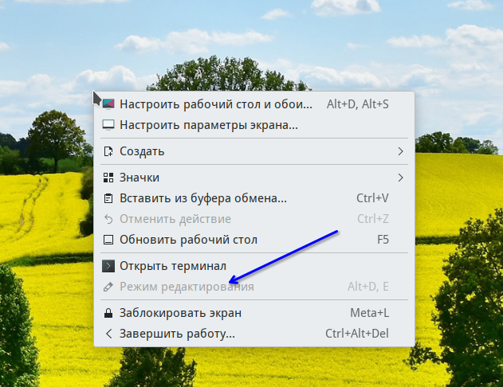

# Блокировка изменения настроек рабочего стола

Документация по изменению настроек рабочего стола

Команда в консоли

### qdbus org.kde.plasmashell /PlasmaShell evaluateScript "lockCorona(true)"

делает не активной кнопку «Режим редактирования» для рабочего стола и панели.

Команда в консоли

### qdbus org.kde.plasmashell /PlasmaShell evaluateScript "lockCorona(false)"

делает активной кнопку «Режим редактирования» для рабочего стола и панели.

