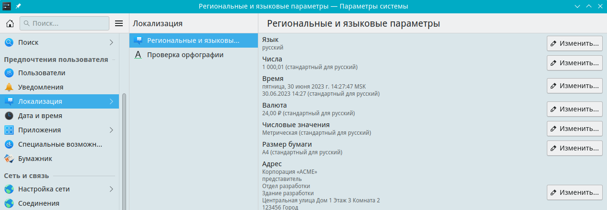

# Настройки локализации

Путь к конфигу: `~/.config/plasma-localerc`

## Локализация

### Локализация - Региональные и языковые параметры - Язык



Для переопределения системных настроек из `/etc/locale.conf`, в
конфиге указывается нужная локаль, например:

#### Русский языка

```ini
[Formats]
LANG=ru_RU.UTF-8

[Translations]
LANGUAGE=ru
```

#### Французский языка

```ini
[Formats]
LANG=fr_FR.UTF-8

[Translations]
LANGUAGE=fr
```

#### Немецкий языка

```ini
[Formats]
LANG=de_DE.UTF-8

[Translations]
LANGUAGE=de
```

#### Американский вариант английского языка

```ini
[Formats]
LANG=en_US.UTF-8

[Translations]
LANGUAGE=en_US
```

#### Британский вариант английского языка

```ini
[Formats]
LANG=en_GB.UTF-8

[Translations]
LANGUAGE=en_GB
```
Эти параметры меняют настройки не только самой локали, но и задают настройки валюты,

стандарт времени, числовые значения, стиль написания имени, телефонный код и стандарт телефонного номера страны.
