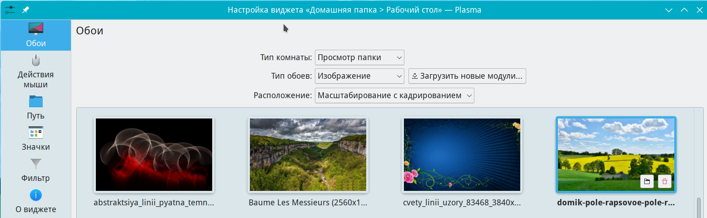

# Общие настройки в профиле пользователя

Документация по plasma-org.kde.plasma.desktop-appletsrc

Путь к конфигу: `~/.config/plasma-org.kde.plasma.desktop-appletsrc`

В конфиге используется числовые секции, например `[40]`, `[58]` и др., и числа у них произвольное. В документе [Скрипты.md](Скрипты.md) описывается, как по шине DBus общаться с "ядром" KDE, командуя ему, какие изменения внести в настройки, добавляя, изменяя и удаляя виджеты. KDE сама подберет числа.

### Расположение значков на рабочем столе

Если в файле ~/.config/plasma-org.kde.plasma.desktop-appletsrc

В секцию

```ini
[Containments][40][General]
ToolBoxButtonState=topcenter
ToolBoxButtonX=748
```

добавить параметр `arrangement=1`, запись параметра вот такого вида

```ini
[Containments][40][General]
ToolBoxButtonState=topcenter
ToolBoxButtonX=748
arrangement=1
```

будет установлено размещение значков `Сверху вниз`

Если из этой секции удалить параметр `arrangement=1`,

сделать запись парамера вот такого вида


```ini
[Containments][40][General]
ToolBoxButtonState=topcenter
ToolBoxButtonX=748
```

будет установлено размещение значков `Слева направо`

## Обои

### Правой кнопкой мыши по рабочему столу - Настроить рабочий стол и обои - Обои



Указывается путь к файлу изображения, например:

В секцию

```ini
[Containments][58][Wallpaper][org.kde.image][General]
Image=/home/victor/.local/share/wallpapers/vindovs-11-2560x1440.jpeg
```

