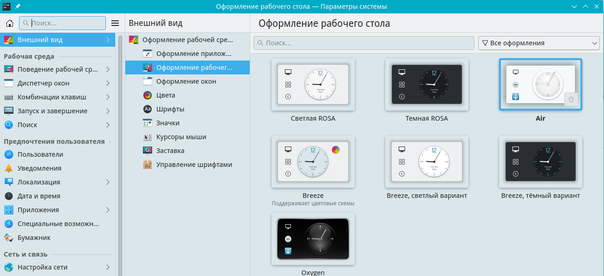

# Настройки оформления рабочего стола

Документация по оформлению рабочего стола

Путь к конфигу: `~/.config/plasmarc`

## Оформление рабочего стола

### Внешний вид - Оформление рабочего стола



Используются оформления рабочей среды, доступные в `/usr/share/plasma/desktoptheme`

Допустимые значения параметра:

#### Air

```ini
[Theme]
name=air
```

#### Светлая Rosa

```ini
[Theme]
name=ROSA-Light
```

#### Breeze, светлый вариант

```ini
[Theme]
name=breeze-light
```

#### Breeze, тёмный вариант

```ini
[Theme]
name=breeze-dark
```

#### Oxygen

```ini
[Theme]
name=oxygen
```


## Другая настройка

Здесь описать какую-либо другую настройку...
