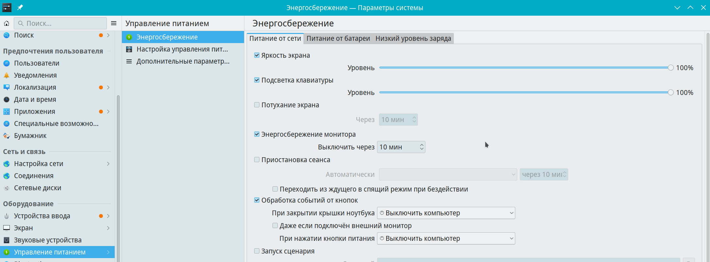

# Настройки электропитания

Путь к конфигу: `~/.config/powermanagementprofilesrc`

#### В дополнение к управлению питанием, доступна функция блокировки экрана.

##### Настройки находятся в «Поведение рабочей среды - Блокировка экрана»

## Энергосбережение

### Управление питанием - Энергосбережение



### Доступные параметры

## Яркость экрана

в конфиг добавляется:

##### Питание от сети

```ini
[AC][BrightnessControl]
value=100
```

##### Питание от батареи

```ini
[Battery][BrightnessControl]
value=50
```
##### Низкий уровень заряда

```ini
[LowBattery][BrightnessControl]
value=30
```

Допустимые значения параметра, например:

* `value=0` — яркость 0 процентов
* `value=50` — яркость 50 процентов
* `value=100` — яркость 100 процентов

### Блокировка параметров

Для запрета пользователю производить изменение яркости экрана, в файле `/etc/xdg/powermanagementprofilesrc`

блокируется изменение параметров, символами блокировки строки параметра `[$i]`, и яркость экрана становится

недоступна для изменения, например:

##### Питание от батареи

```ini
[Battery][BrightnessControl]
value[$i]=50
```

##### Питание от сети

```ini
[AC][BrightnessControl]
value[$i]=100
```

##### Низкий уровень заряда

```ini
[LowBattery][BrightnessControl]
value[$i]=30
```

## Подсветка клавиатуры

в конфиг добавляется, например:

##### Питание от сети


```ini
[AC][KeyboardBrightnessControl]
value=100
```

##### Питание от батареи

```ini
[Battery][KeyboardBrightnessControl]
value=50
```

##### Низкий уровень заряда

```ini
[LowBattery][KeyboardBrightnessControl]
value=0
```

Допустимые значения параметра, например:

* `value=0` — яркость 0 процентов
* `value=50` — яркость 50 процентов
* `value=100` — яркость 100 процентов

### Блокировка параметров

Для запрета пользователю производить изменение подсветки клавиатуры, в файле `/etc/xdg/powermanagementprofilesrc`

блокируется изменение параметров, символами блокировки строки параметра `[$i]`, и подсветка клавиатуры становится

недоступна для изменения, например:

##### Питание от батареи

```ini
[Battery][KeyboardBrightnessControl]
value[$i]=50
```

##### Питание от сети

```ini
[AC][KeyboardBrightnessControl]
value[$i]=100
```

##### Низкий уровень заряда

```ini
[LowBattery][KeyboardBrightnessControl]
value[$i]=0
```
При установке галочки на чекбокс

## Потухание экрана

в конфиг добавляется:

##### Питание от сети

```ini
[AC][DimDisplay]
idleTime=600000
```

##### Питание от батареи

```ini
[Battery][DimDisplay]
idleTime=120000
```
##### Низкий уровень заряда

```ini
[LowBattery][DimDisplay]
idleTime=60000
```

Допустимы значения параметра в миллисекундах, например:

* `idleTime=600000` — яркость 600000 миллисекунд, 10 минут
* `idleTime=120000` — яркость 120000 миллисекунд, 2 минуты
* `idleTime=60000` — яркость 60000 миллисекунд, 1 минута

Для указания используется точное время в минутах, заданное в миллисекундах.

Если время в миллисекундах указано неверно, и не соответствует целому значению в минутах,

то время автоматически округляется в ближайшему целому значению в минутах.

#### Полное отключение параметра потухания экрана

Для полного отключения потухания экрана, из `/etc/xdg/powermanagementprofilesrc`

должены быть полностью удалены значения строки параметров

##### Питание от сети

* `[AC][DimDisplay]`

##### Питание от батареи

* `[Battery][DimDisplay]`

##### Низкий уровень заряда

* `[LowBattery][DimDisplay]`


### Блокировка параметров

Для запрета пользователю производить изменение времени потухания экрана, в файле `/etc/xdg/powermanagementprofilesrc`

блокируется изменение параметров, символами блокировки строки параметра `[$i]`, и время потухание экрана становится

недоступно для изменения, например:


##### Питание от сети

```ini
[AC][DimDisplay]
idleTime[$i]=600000
```

##### Питание от батареи

```ini
[Battery][DimDisplay]
idleTime[$i]=120000
```
##### Низкий уровень заряда

```ini
[LowBattery][DimDisplay]
idleTime[$i]=60000
```

#### Полное отключение параметра потухания экрана с блокировкой включения

Для полного отключения потухания экрана с блокировкой включения, из `/etc/xdg/powermanagementprofilesrc`

должены быть полностью удалены значения строки параметров, а строка параметра заблокирована

символом блокировки [$i]

##### Питание от сети

* `[AC][DimDisplay][$i]`

##### Питание от батареи

* `[Battery][DimDisplay][$i]`

##### Низкий уровень заряда

* `[LowBattery][DimDisplay][$i]`

## Энергосбережение монитора

в конфиг добавляется:

##### Питание от сети

```ini
[AC][DPMSControl]
idleTime=600
```

##### Питание от батареи

```ini
[Battery][DPMSControl]
idleTime=300
```
##### Низкий уровень заряда

```ini
[LowBattery][DPMSControl]
idleTime=60
```

Допустимы значения параметра в секундах, например:

* `idleTime=600` — выключить через 600 секунд, 10 минут
* `idleTime=300` — выключить через 300 секунд, 5 минут
* `idleTime=60` — выключить через 60 секунд, 1 минута

Для указания используется точное время в минутах, заданное в секундах.

Если время в секундах указано неверно, и не соответствует целому значению в минутах,

то время автоматически округляется в ближайшему целому значению в минутах.

#### Полное отключение параметра энергосбережения монитора

Для полного отключения энергосбережения монитора,

из `/etc/xdg/powermanagementprofilesrc` должены быть полностью удалены

значения строки параметров

##### Питание от сети

* `[AC][DPMSControl]`

##### Питание от батареи

* `[Battery][DPMSControl]`

##### Низкий уровень заряда

* `[LowBattery][DPMSControl]`

### Блокировка параметров

Для запрета пользователю производить изменение времени энергосбережения монитора,

в файле `/etc/xdg/powermanagementprofilesrc` блокируется изменение параметров,

символами блокировки строки параметра `[$i]`, и время энергосбережения монитора становится

недоступно для изменения, например:


##### Питание от сети

```ini
[AC][DPMSControl]
idleTime[$i]=600
```

##### Питание от батареи

```ini
[Battery][DPMSControl]
idleTime[$i]=300
```
##### Низкий уровень заряда

```ini
[LowBattery][DPMSControl]
idleTime[$i]=60
```

#### Полное отключение параметра энергосбережения монитора с блокировкой включения

Для полного отключения энергосбережения монитора с блокировкой включения,

из `/etc/xdg/powermanagementprofilesrc` должены быть полностью удалены

значения строки параметров, а строка параметра заблокирована

символом блокировки [$i]

##### Питание от сети

* `[AC][DPMSControl][$i]`

##### Питание от батареи

* `[Battery][DPMSControl][$i]`

##### Низкий уровень заряда

* `[LowBattery][DPMSControl][$i]`


## Приостановка сеанса

в конфиг добавляется:

##### Питание от сети

```ini
[AC][SuspendSession]
idleTime=900000
suspendThenHibernate=false
suspendType=1
```

##### Питание от батареи

```ini
[Battery][SuspendSession]
idleTime=600000
suspendThenHibernate=false
suspendType=1
```
##### Низкий уровень заряда

```ini
[LowBattery][SuspendSession]
idleTime=300000
suspendThenHibernate=false
suspendType=1
```

Допустимы значения параметра, например:

##### Время задержки в миллисекундах

* `idleTime=900000` — задержка приостановки сеанса 900000 миллисекунд, 15 минут
* `idleTime=600000` — задержка приостановки сеанса 600000 миллисекунд, 10 минуты
* `idleTime=300000` — задержка приостановки сеанса 300000 миллисекунд, 5 минута

##### Тип действия

* `suspendType=1` — перейти в ждущий режим
* `suspendType=2` — перейти в спящий режим
* `suspendType=4` — перейти в гибридный спящий режим
* `suspendType=8` — выключить компьютер
* `suspendType=32` — заблокировать экран

#### Переходить из ждущего в спяший режим при бездействии

Параметр `suspendThenHibernate` используется для перехода из ждущего в

спяший режим при бездействии.

* `Enabled=false` — не переходить из ждущего в спяший режим при бездействии
* `Enabled=true` — переходить из ждущего в спяший режим при бездействии

### Блокировка параметров

Для запрета пользователю производить изменение времени приостановки сеанса,

в файле `/etc/xdg/powermanagementprofilesrc` блокируется изменение параметров,

символами блокировки строки параметра `[$i]`, и время приостановки сеанса становится

недоступно для изменения, например:

#### Время задержки

##### Питание от сети

```ini
[AC][SuspendSession]
idleTime[$i]=900000
suspendThenHibernate=false
suspendType=1
```

##### Питание от батареи

```ini
[Battery][SuspendSession]
idleTime[$i]=600000
suspendThenHibernate=false
suspendType=1
```
##### Низкий уровень заряда

```ini
[LowBattery][SuspendSession]
idleTime[$i]=300000
suspendThenHibernate=false
suspendType=1
```

#### Тип действия

##### Питание от сети

```ini
[AC][SuspendSession]
idleTime=900000
suspendThenHibernate=false
suspendType[$i]=1
```

##### Питание от батареи

```ini
[Battery][SuspendSession]
idleTime=600000
suspendThenHibernate=false
suspendType[$i]=1
```
##### Низкий уровень заряда

```ini
[LowBattery][SuspendSession]
idleTime=300000
suspendThenHibernate=false
suspendType[$i]=1
```

#### Переход из ждущего в спяший режим при бездействии

##### Питание от сети

```ini
[AC][SuspendSession]
idleTime=900000
suspendThenHibernate[$i]=false
suspendType=1
```

##### Питание от батареи

```ini
[Battery][SuspendSession]
idleTime=600000
suspendThenHibernate[$i]=false
suspendType=1
```
##### Низкий уровень заряда

```ini
[LowBattery][SuspendSession]
idleTime=300000
suspendThenHibernate[$i]=false
suspendType=1
```

#### Время задержки, тип действия и переход из ждущего в спяший

#### режим при бездействии, блокировкой изменения группы

##### Питание от сети

```ini
[AC][SuspendSession][$i]
idleTime=900000
suspendThenHibernate=false
suspendType=1
```

##### Питание от батареи

```ini
[Battery][SuspendSession][$i]
idleTime=600000
suspendThenHibernate=false
suspendType=1
```
##### Низкий уровень заряда

```ini
[LowBattery][SuspendSession][$i]
idleTime=300000
suspendThenHibernate=false
suspendType=1
```

#### Полное отключение параметра приостановки сеанса с блокировкой включения

Для полного отключения приостановки сеанса с блокировкой включения,

из `/etc/xdg/powermanagementprofilesrc` должены быть полностью удалены

значения строки параметров, а строка параметра заблокирована

символом блокировки [$i]

##### Питание от сети

* `[AC][SuspendSession][$i]`

##### Питание от батареи

* `[Battery][SuspendSession][$i]`

##### Низкий уровень заряда

* `[LowBattery][SuspendSession][$i]`

## Обработка событий от кнопок

в конфиг добавляется:

##### Питание от сети

```ini
[AC][HandleButtonEvents]
lidAction=1
powerButtonAction=16
powerDownAction=16
triggerLidActionWhenExternalMonitorPresent=false
```

##### Питание от батареи

```ini
[Battery][HandleButtonEvents]
lidAction=1
powerButtonAction=16
powerDownAction=16
triggerLidActionWhenExternalMonitorPresent=false
```
##### Низкий уровень заряда

```ini
[LowBattery][HandleButtonEvents]
lidAction=1
powerButtonAction=16
powerDownAction=16
triggerLidActionWhenExternalMonitorPresent=false
```

Допустимы значения параметра, например:

##### При закрытии крышки ноутбука

* `lidAction=0` — ничего не делать
* `lidAction=1` — перейти в ждущий режим
* `lidAction=2` — перейти в спящий режим
* `lidAction=4` — перейти в гибридный спящий режим
* `lidAction=8` — выключить компьютер
* `lidAction=32` — заблокировать экран
* `lidAction=64` — выключить монитор

#### Даже если подключен внешний монитор

Параметр `triggerLidActionWhenExternalMonitorPresent` используется для подтверждения

действия при закрытии крышки ноутбука, если подключен внешний монитор.

* `Enabled=false` — действие при закрытии крышки ноутбука не активно, если подключен внешний монитор
* `Enabled=true` — действие при закрытии крышки ноутбука активно, если подключен внешний монитор

##### При нажатии кнопки питания

* `powerButtonAction=0` — ничего не делать
* `powerButtonAction=1` — перейти в ждущий режим
* `powerButtonAction=2` — перейти в спящий режим
* `powerButtonAction=4` — перейти в гибридный спящий режим
* `powerButtonAction=8` — выключить компьютер
* `powerButtonAction=16` — диалог подтверждения выхода
* `powerButtonAction=32` — заблокировать экран
* `powerButtonAction=64` — выключить монитор

### Блокировка параметров

Для запрета пользователю производить изменение обработки событий от кнопок,

в файле `/etc/xdg/powermanagementprofilesrc` блокируется изменение параметров,

символами блокировки строки параметра `[$i]`, и обработка событий от кнопок становится

недоступна для изменения, например:

##### При закрытии крышки ноутбука

* `lidAction[$i]=0` — ничего не делать
* `lidAction[$i]=1` — перейти в ждущий режим
* `lidAction[$i]=2` — перейти в спящий режим
* `lidAction[$i]=4` — перейти в гибридный спящий режим
* `lidAction[$i]=8` — выключить компьютер
* `lidAction[$i]=32` — заблокировать экран
* `lidAction[$i]=64` — выключить монитор

##### При нажатии кнопки питания

* `powerButtonAction[$i]=0` — ничего не делать
* `powerButtonAction[$i]=1` — перейти в ждущий режим
* `powerButtonAction[$i]=2` — перейти в спящий режим
* `powerButtonAction[$i]=4` — перейти в гибридный спящий режим
* `powerButtonAction[$i]=8` — выключить компьютер
* `powerButtonAction[$i]=16` — диалог подтверждения выхода
* `powerButtonAction[$i]=32` — заблокировать экран
* `powerButtonAction[$i]=64` — выключить монитор

#### Даже если подключен внешний монитор

* `triggerLidActionWhenExternalMonitorPresent[$i]=false` — действие при закрытии крышки ноутбука не активно, если подключен внешний монитор
* `triggerLidActionWhenExternalMonitorPresent[$i]=true` — действие при закрытии крышки ноутбука активно, если подключен внешний монитор

#### Полное отключение параметра обработки событий от кнопок с блокировкой включения

Для полного отключения обработки событий от кнопок с блокировкой включения,

в `/etc/xdg/powermanagementprofilesrc` должены быть полностью отключены

все значения строки параметров, а строка параметра заблокирована

символом блокировки [$i]

##### Питание от сети

```ini
[AC][HandleButtonEvents][$i]
lidAction=0
powerButtonAction=0
triggerLidActionWhenExternalMonitorPresent=false
```

##### Питание от батареи

```ini
[Battery][HandleButtonEvents][$i]
lidAction=0
powerButtonAction=0
triggerLidActionWhenExternalMonitorPresent=false
```
##### Низкий уровень заряда

```ini
[LowBattery][HandleButtonEvents][$i]
lidAction=0
powerButtonAction=0
triggerLidActionWhenExternalMonitorPresent=false
```
