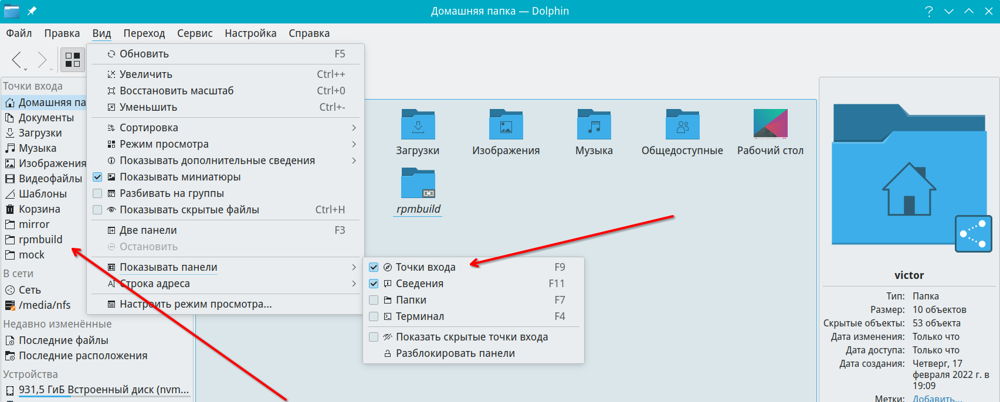

# Точки входа в dolphin

Сведения о точках входа в dolphin

Путь к конфигу: `~/.local/share/user-places.xbel`

## Точки входа

### Меню Dolphin - Вид - Показывать панели - Точки входа



Для точек входа указывается полный путь к папке, например

```ini
 <bookmark href="file:///home/victor/Загрузки">
  <title>Downloads</title>
  <info>
   <metadata owner="http://freedesktop.org">
    <bookmark:icon name="folder-downloads"/>
   </metadata>
   <metadata owner="http://www.kde.org">
    <ID>1649336988/3</ID>
    <isSystemItem>true</isSystemItem>
    <IsHidden>false</IsHidden>
   </metadata>
  </info>
```

