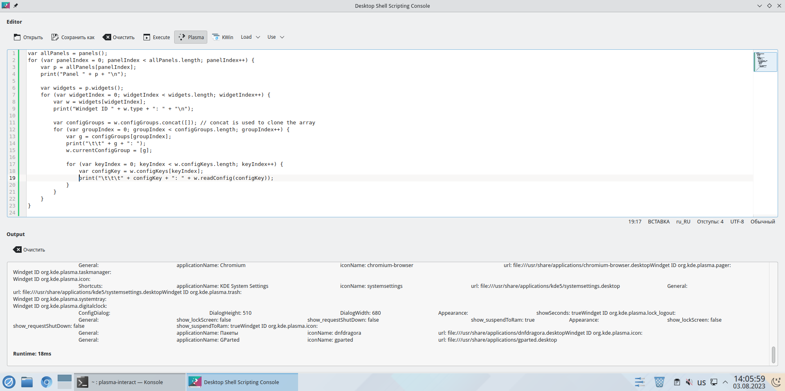
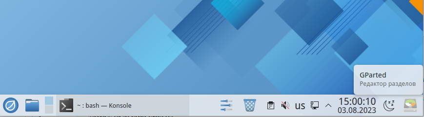

# Скрипты

## Документация

* https://develop.kde.org/docs/plasma/scripting/
* https://userbase.kde.org/KDE_System_Administration/PlasmaDesktopScripting/Examples

## Способы запуска скриптов

### Через интерактивную консоль (вручную, для отладки)

Интерактивная консоль запускается командой `plasma-interactiveconsole`.



### По D-Bus (по требованию)

Можно по D-Bus передать тело скрипта:

```bash
qdbus org.kde.plasmashell /PlasmaShell org.kde.PlasmaShell.evaluateScript '
    строка1;
    строка2;
'
```

Внутри кавычек код на JavaScript. Использовать именно qdbus необязательно, можно использовать любой другой клиент dbus.

### При запуске plasmashell (автоматически)

При запуске plasmashell (графической оболочик KDE) выполняются все скрипты `*.js` из `/usr/share/plasma/shells/org.kde.plasma.desktop/contents/updates/`, последовательно, с сортировкой по алфавиту.

Скрипты из домашней папки пользователя почему-то не выполняются, якобы в целях безопасности.

В файл `~/.config/plasmashellrc` записывается, какие скрипты были выполнены. Выполненные не выполняются снова. Пример записи в этом файле:

```ini
[Updates]
performed=/usr/share/plasma/shells/org.kde.plasma.desktop/contents/updates/obsolete_kickoffrc.js,/usr/share/plasma/shells/org.kde.plasma.desktop/contents/updates/unlock_widgets.js
```

## Примеры скриптов

### Добавление иконки запуска приложения на панель

```javascript
// Добавляем иконку gparted
pp = panels()[0].addWidget("org.kde.plasma.icon");
pp.currentConfigGroup = "General"; // обязательна ли эта строка?
//pp.writeConfig("applicationName", "GParted");
//pp.writeConfig("iconName", "gparted");
pp.writeConfig("url","file:///usr/share/applications/gparted.desktop");

// можно по аналогии добавить еще одну иконку

// Записываем конфиг ~/.config/plasma-org.kde.plasma.desktop-appletsrc
pp.reloadConfig();
```

Если не указать `applicationName` и `iconName`, то их значения будут автоматически браться из desktop-файла. В скрипте выше соответствующие строки закомметнированы.

Если такой текст вставить в `/usr/share/plasma/shells/org.kde.plasma.desktop/contents/updates/test.js` и перезагрузить систему, то на панель добавляется иконка:



*TODO*: надо бы как-то добавлять иконку в правильное место. Сейчас она добавляется в конец панели при запуске скрипта из папки /updates/ и в другое место — после переключателя рабочих столов — при запуске из `plasma-interactiveconsole`. В документации https://develop.kde.org/docs/plasma/scripting/api/ сказано, что функцию addWidget можно вызывать как с просто указанием имени виджета (`addWidget(string name)`), так и с указанием координат, ширины и высоты (`addWidget(string name, number x, y, w, h)`). У меня сходу не получилось подобрать цифровые значения x, y, w, h. Пробовал 1, 0, -1, 2 и т.д.

В `~/.config/plasma-org.kde.plasma.desktop-appletsrc` появляются записи такого вида:

```ini
[Containments][2][Applets][24][Configuration]
localPath=/home/user/.local/share/plasma_icons/gparted (29).desktop
url=file:///usr/share/applications/gparted.desktop

[Containments][2][Applets][24][Configuration][General]
url=file:///usr/share/applications/gparted.desktop
```

Также был обновлен файл `~/.config/plasmashellrc`: в Updates/performed был добавлен путь к скрипту — `/usr/share/plasma/shells/org.kde.plasma.desktop/contents/updates/test.js`.

### Удаление иконки с панели задач

```javascript
p = panels()[0]
var widgets = p.widgets();
for (var widgetIndex = 0; widgetIndex < widgets.length; widgetIndex++) {
	var w = widgets[widgetIndex];
	var delIdx = 0;
	var configGroups = w.configGroups.concat([]); // concat is used to clone the array
	for (var groupIndex = 0; groupIndex < configGroups.length; groupIndex++) {
		var g = configGroups[groupIndex];
		w.currentConfigGroup = [g];
		for (var keyIndex = 0; keyIndex < w.configKeys.length; keyIndex++) {
			var configKey = w.configKeys[keyIndex];
			if (w.readConfig(configKey) === "file:///usr/share/applications/gparted.desktop") delIdx = widgetIndex; // Тут прописываем, что удалить
		 }
	}
	if (delIdx > 0) w.remove();
}
```

Поскольку идет перебор всех параметров виджета, а качестве configKey можно прописать как значение url, так и значения applicationName или iconName.
